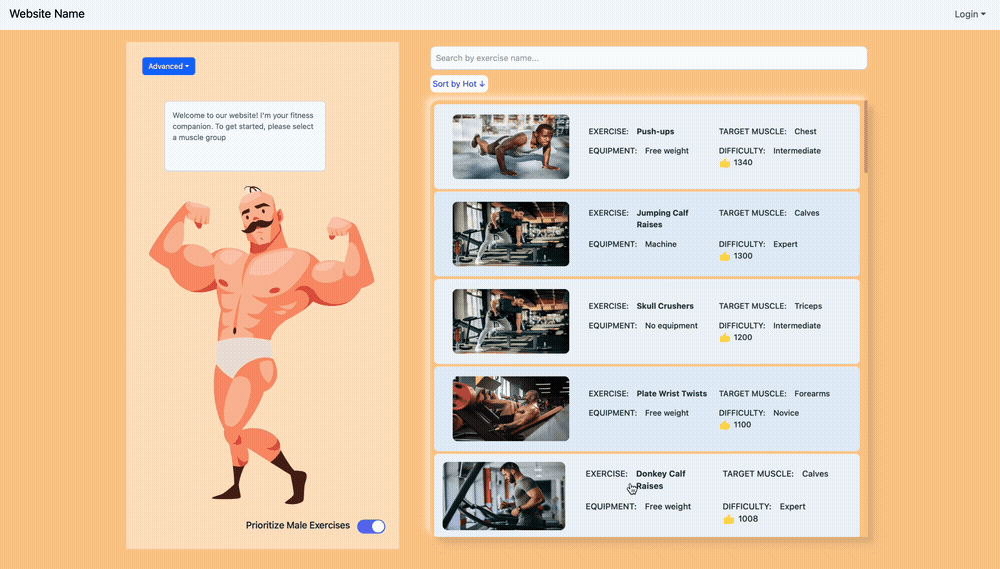
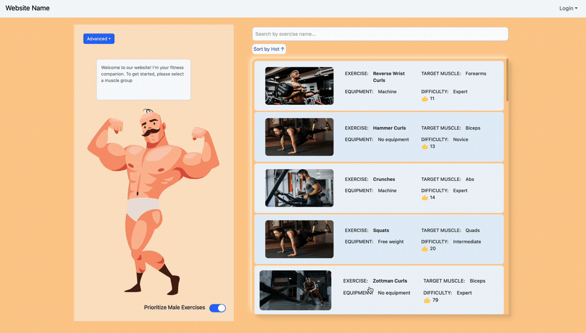

# Fitness Companion - Horizontal Prototype

Welcome to the Fitness Companion project! This is a horizontal prototype of a website designed to show exercises based on a selectable body part figure. The prototype focuses on demonstrating the UI/UX design and the main feature of convenient exercise search rather than full website functionality.

## Project Overview

The Fitness Companion website allows users to select different body parts on a person figure to view related exercises. The prototype showcases the use of React with Vite for fast development, along with Tailwind CSS, Bootstrap, and Material UI for styling.

## Features

- **Selectable Body Parts**: Users can click on different parts of a body figure to see exercises targeting those muscles.
- **Exercise Display**: Shows a list of exercises with details such as equipment, target muscle, difficulty level, and popularity.
- **Filtering and Sorting**: Users can filter exercises by muscle group and sort them by different criteria.
- **User Interface**: Utilizes Tailwind CSS, Bootstrap, and Material UI for a clean and responsive design.
- **Toggle Switch**: Option to prioritize exercises for male or female users.
  
### Selecting Body Parts

Click on the body parts of the illustrated figure on the left to view related exercises on the right panel. Use the search bar to filter exercises by name, and the sorting dropdown to arrange them by popularity or difficulty.
- Main Functionality



## Technologies Used

- **React + Vite**: For building a fast and modern web application.
- **Tailwind CSS**: For utility-first CSS styling.
- **Bootstrap**: For responsive grid system and components.
- **Material UI**: For modern and customizable UI components.

## Getting Started

### Prerequisites

Ensure you have the following installed on your development machine:

- Node.js (>= 14.x)
- npm (>= 6.x) or yarn (>= 1.x)

### Installation

1. Clone the repository:

   ```bash
   git clone https://github.com/yourusername/coursework.git
   cd coursework/fitness-companion
   ```

2. Install dependencies:

   ```bash
   npm install
   ```

### Running the Development Server

To start the development server, run:

```bash
npm run dev
```

Open your browser and navigate to `http://localhost:____` to view the app.

### Building for Production

Already added production version.

## Other Demonstrations
- plays a responsive video along with the required steps to perform the exercise.


- added last moment features for adding exercises, sorting and user profile on the main page...

